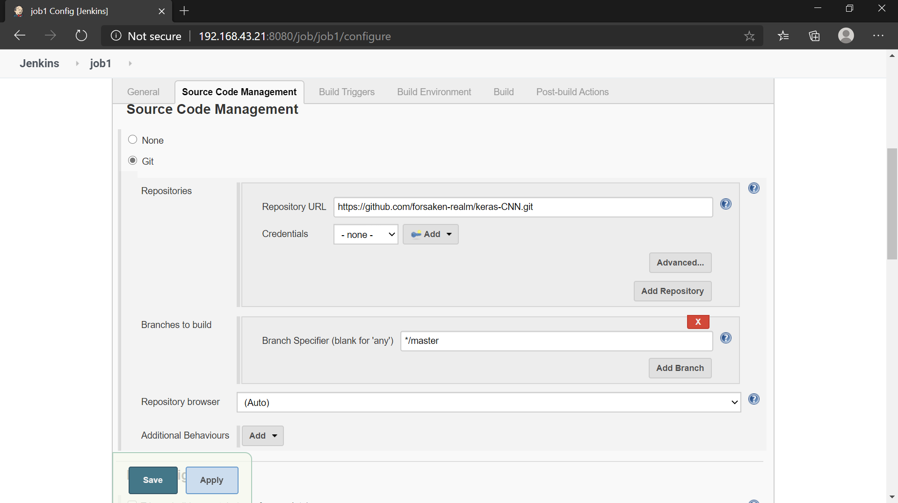
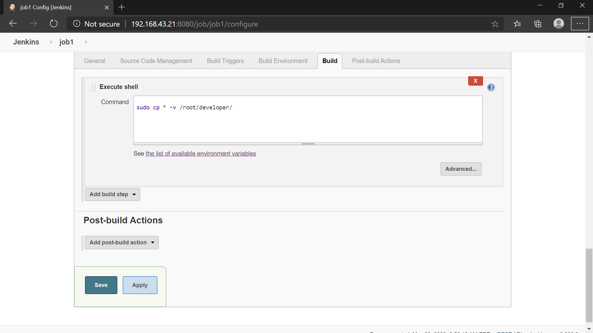
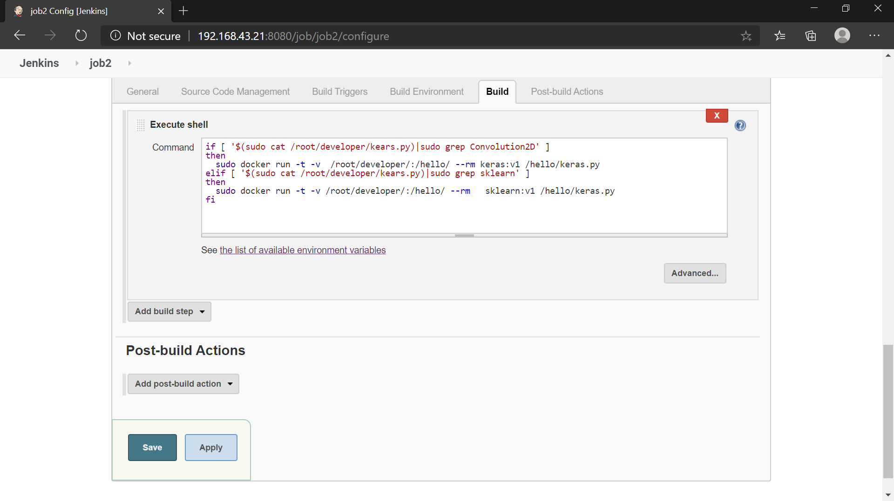
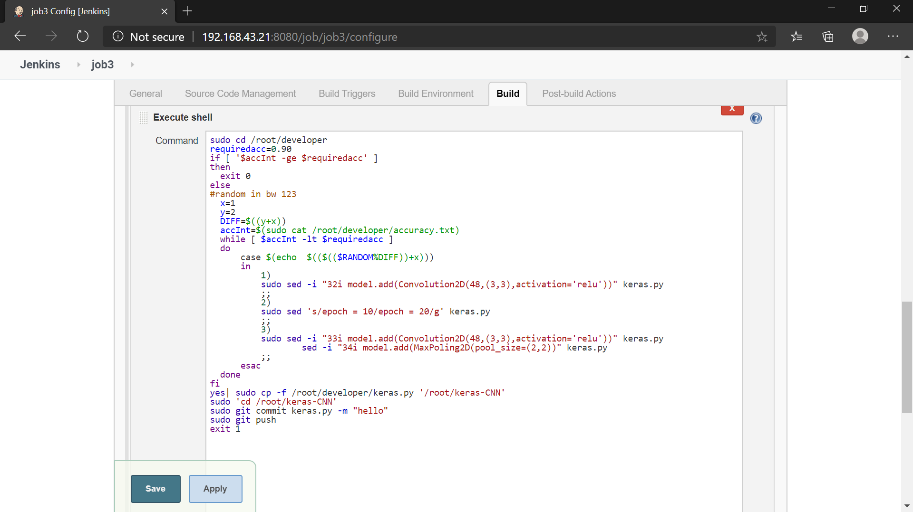

# MLOps : machine learning and operations
***This document discusses techniques for implementing and automating continuous integration (CI) of machine learning (ML) system***  

This project documentation is for data scientists and ML engineers who want to apply **DevOps** principles to ML systems **(MLOps)**. **MLOps** is an ML engineering culture and practice that aims at unifying ML system development (Dev) and ML system operation (Ops). Practicing MLOps means that you advocate for automation and monitoring at all steps of ML system construction, including integration, testing etc.

# ***INITIAL SETUP***
 * installed linux OS(espcially redhat) 
 * pre installed docker in linux.To install [click here](https://docs.docker.com/engine/install/)
 * pre installed jenkins in linux.Information regarding install [click here](https://www.jenkins.io/download/)
 * pre installed git in linux.To install [click here](https://git-scm.com/download/linux)

# ***setting up docker***
 build the images using the dockerfile given in Dockerfile folder 
     
     - docker build -t your_image_name:version .
      
# ***JENKINS***  
1) **JOB1**:Checks the github repository for every one minute and if any developer pushes the code to github jenkins download the code and datasets and then copy it to developer folder in base system 
   

2) **JOB2**:checks the downlaoded the code and analyses wheather it's a CNN/ANN/LINEAR_REGRESSION code and lauches respective docker container in linux system for training the model

       #copy the above code in execute shell
       if [ '$(sudo cat /root/developer/kears.py)|sudo grep Convolution2D' ]
       then
         sudo docker run -t -v  /root/developer/:/hello/ --rm keras:v1 /hello/keras.py 
       elif [ '$(sudo cat /root/developer/kears.py)|sudo grep sklearn' ]
       then
         sudo docker run -t -v /root/developer/:/hello/ --rm   sklearn:v1 /hello/keras.py
       fi

3) **JOB3**:Checks the accuracy of the trained model and if the accuarcy is not over 90% then **JOB3** tweak the architecture of the model and push back the code to github to retrain the model for  better accuracy.This cycle goes until accuracy of 90% is not acchieved.
when the desired accuracy is achieved then **JOB4** take the role in play
        
       sudo cd /root/developer
       requiredacc=0.90
       if [ '$accInt -ge $requiredacc' ]
       then 
         exit 0
       else
         #random in bw 123
         x=1
         y=2
         DIFF=$((y+x))
         accInt=$(sudo cat /root/developer/accuracy.txt)
         while [ $accInt -lt $requiredacc ] 
         do
            case $(echo  $(($(($RANDOM%DIFF))+x))) 
	    in
	       1)
	       sudo sed -i "32i model.add(Convolution2D(48,(3,3),activation='relu'))" keras.py
	       ;;
	       2)
	       sudo sed 's/epoch = 10/epoch = 20/g' keras.py
	       ;;
               3)
	       sudo sed -i "33i model.add(Convolution2D(48,(3,3),activation='relu'))" keras.py
                        sed -i "34i model.add(MaxPoling2D(pool_size=(2,2))" keras.py
	       ;;
	     esac	
         done
       fi
       yes| sudo cp -f /root/developer/keras.py '/root/keras-CNN'
       sudo 'cd /root/keras-CNN'
       sudo git commit keras.py -m "hello"
       sudo git push
       exit 1

